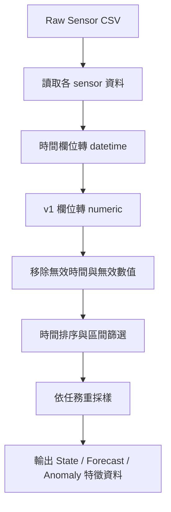
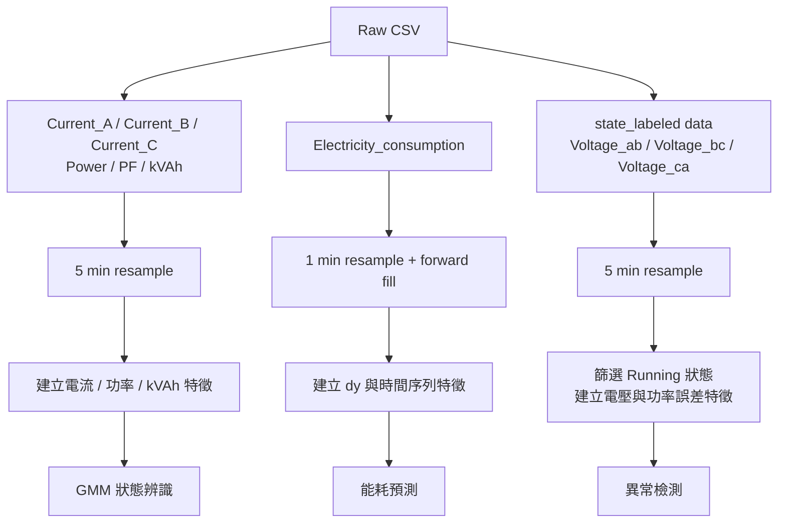
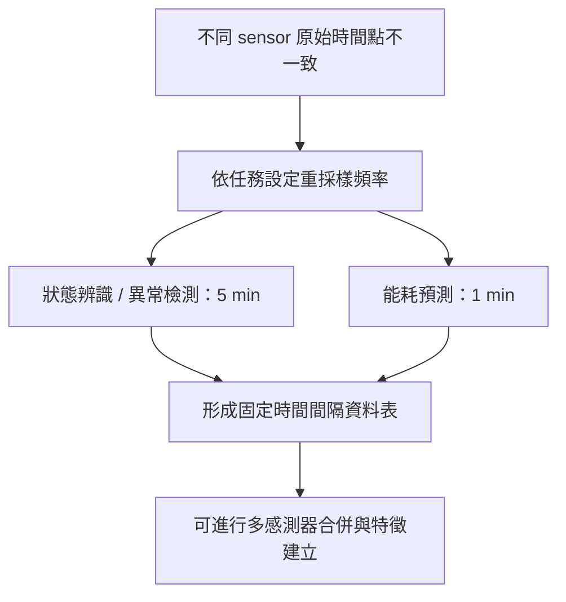

# 3.2.2 資料前處理圖表資料

## 圖 3-2 資料前處理總流程圖

用途：說明所有分析模組共用的資料清洗流程。

## 圖 3-3 各分析模組資料流與特徵建立流程

用途：說明三個分析模組雖然共用原始資料來源，但各自使用不同感測器、重採樣頻率與特徵集合。

## 圖 3-4 多感測器時間對齊與重採樣示意圖

用途：說明不同感測器採樣頻率不同時，為何需要先進行時間對齊與重採樣。

## 表 3-1 原始感測資料欄位與用途

| 資料類型 | Sensor | 主要用途 |
|---|---|---|
| 三相電流 | Current_A、Current_B、Current_C | 負載狀態、電流不平衡 |
| 三相電壓 | Votage_ab、Votage_bc、Votage_ca | 供電品質、電壓偏差 |
| 功率 | Instantaneous_Total_Power | 負載強度 |
| 功率因數 | PF | 電力效率 |
| 累積用電量 | Electricity_consumption | 能耗預測 |
| 視在電能 | kVAh | 狀態辨識、耗能變化 |
| 通訊狀態 | Modbus_404、Modbus_Timeout | 資料品質參考 |

## 表 3-2 各分析模組資料前處理設定

| 模組 | 輸入資料 | 重採樣頻率 | 主要處理 |
|---|---|---:|---|
| 狀態辨識 | 三相電流、Power、PF、kVAh | 5 min | 合併 sensor、建立電流與功率特徵、標準化 |
| 能耗預測 | Electricity_consumption | 1 min | forward fill、差分 dy、IQR 移除極端值 |
| 異常檢測 | state_labeled、三相電壓 | 5 min | 篩選 Running 狀態、建立電壓與功率誤差特徵 |

## 表 3-3 GMM 狀態辨識特徵

| 特徵 | 說明 |
|---|---|
| I_mean | 三相電流平均 |
| I_imbalance | 三相電流不平衡率 |
| Power | 瞬時總功率 |
| PF_abs | 功率因數絕對值 |
| kVAh_rate | kVAh 差分，負值裁為 0 |

## 表 3-4 能耗預測特徵

| 特徵類型 | 特徵 |
|---|---|
| 目標值 | dy，每分鐘耗電增量 |
| 時間特徵 | hour、minute、day_of_week、day_of_month、month、is_weekend |
| Lag 特徵 | lag 1、5、10、30、60、1440、10080 |
| Rolling 特徵 | rolling mean 5、30、60 |

註：Prophet 主要使用 `ds` 與目標值；Lag 與 Rolling 特徵主要供 XGBoost、LightGBM 等樹模型使用。

## 表 3-5 異常檢測特徵

| 特徵 | 說明 |
|---|---|
| I_mean | 平均電流 |
| I_imbalance | 電流不平衡率 |
| dI_dt | 電流變化量 |
| Power | 瞬時總功率 |
| PF_abs | 功率因數絕對值 |
| kVAh_rate | kVAh 差分 |
| V_mean | 三相電壓平均 |
| V_imbalance | 電壓不平衡率 |
| V_deviation | 相對 220V 偏差 |
| P_error | 估算功率與實測功率誤差 |

